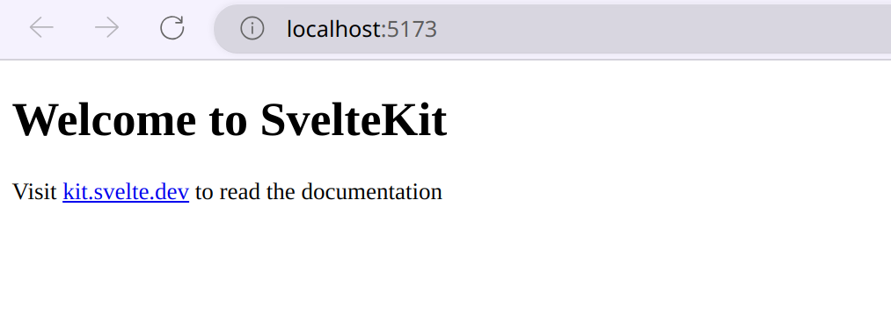

# Một số ghi chú cho khóa học Backend với Node.JS (buổi 3)

## Svelte
Svelte (đọc là Sờ Veo) là một framework để viết frontend như React, Vue hay Angular. Điểm sáng đầu tiên có thể kể đến của Svelte đó là code Svelte vô cùng đơn giản, thậm chí đơn giản hơn cả Vue. Hơn nữa thì Svelte có tốc độ cũng như file build ra nhẹ hơn rất nhiều so với 3 đối thủ kể trên.

Để tạo một dự án Svelte, ta sử dụng lệnh
```sh
npm create svelte@latest my-app
```
trong đó `my-app` là tên thư mục cũng như tên dự án mà ta muốn đặt. Nếu chương trình hỏi "Which Svelte app template?" thì ta chọn "Skeleton project" để tạo dự án rỗng, nếu chương trình hỏi "Add type checking with TypeScript?" thì ta chọn "No" và nếu chương trình hỏi "Select additional options" thì ấn Enter để hoàn tất. Sau đó truy cập vào thư mục và install package
```sh
cd my-app
npm install
```
rồi dùng lệnh sau để chạy chương trình
```sh
npm run dev
```


Thư mục của chúng ta lúc này trông tương đối phức tạp, nhưng ta chỉ quan tâm đến thư mục `src/routes` mà thôi. Cụ thể ta sẽ bắt đầu code trang index trong file `src/routes/+page.svelte`
```svelte
<!-- Javascript -->
<script>
let name = "Khoa"
let age = 20
</script>

<!-- HTML -->
<h1>Welcome to {name}'s website</h1>
<div class="card">{name} is {age} years old</div>

<!-- CSS -->
<style>
.card {
    padding: 10px;
}
</style>
```
Tham khảo thêm về Svelte tại [https://svelte.dev/docs/introduction](https://svelte.dev/docs/introduction)